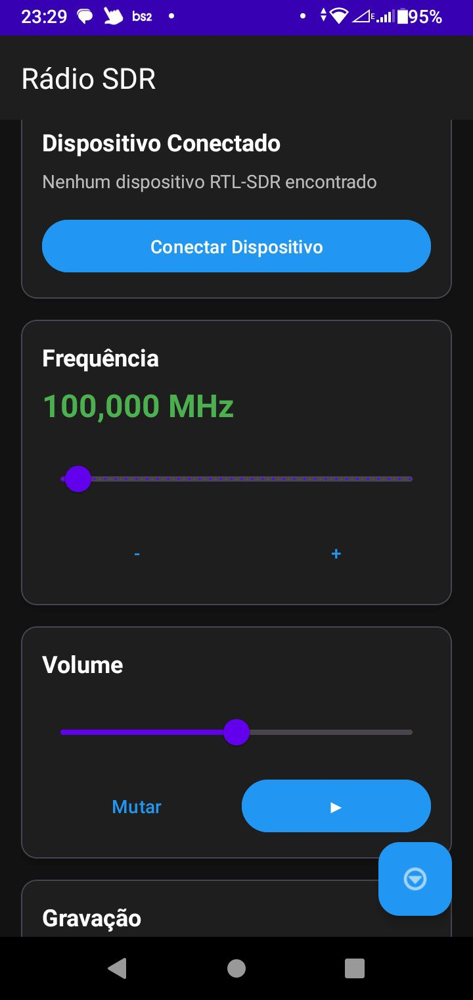
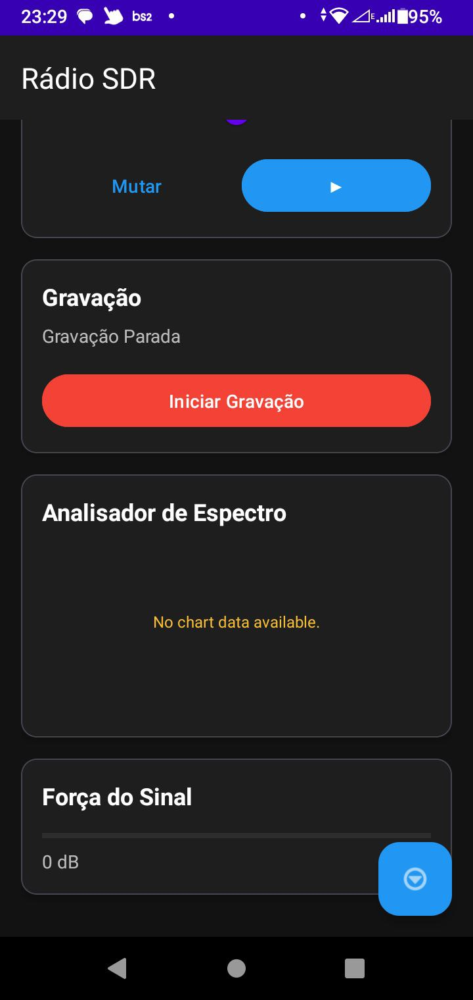
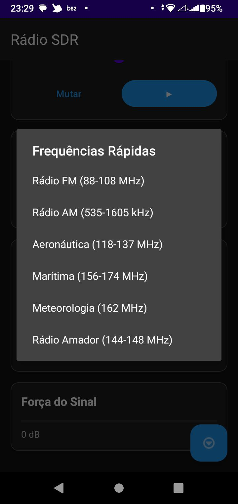

# 📻 SDR Radio Android

Um aplicativo completo para Software Defined Radio (SDR) que permite sintonizar, reproduzir e gravar sinais de rádio usando dispositivos RTL-SDR via USB OTG.

## ✨ Funcionalidades

- 🔌 **Detecção automática** de dispositivos RTL-SDR
- 📻 **Sintonização** de 24 MHz a 1.766 GHz
- 🔊 **Reprodução de áudio** em tempo real
- 📹 **Gravação** com timestamp automático
- 📊 **Analisador de espectro** em tempo real
- 📶 **Medidor de força do sinal**
- ⚡ **Presets de frequências** (FM, AM, Aeronáutica, etc.)
- 🎨 **Interface moderna** com Material Design

## 🚀 Instalação Rápida

### Pré-requisitos
- Android 5.0+ (API 21)
- RTL-SDR (RTL2832U + R820T/R820T2)
- Cabo OTG compatível
- Gradle 7.6

### Build e Instalação

```bash
# Clone o projeto
git clone https://github.com/seu-usuario/sdr-radio.git
cd sdr-radio

# Download do Gradle 7.6
wget https://services.gradle.org/distributions/gradle-7.6-bin.zip
unzip gradle-7.6-bin.zip

# Configurar wrapper
mkdir -p gradle/wrapper
cp gradle-7.6/lib/plugins/gradle-wrapper-7.6.jar gradle/wrapper/gradle-wrapper.jar

# Build e instalação
./gradle-7.6/bin/gradle installDebug
```

### Uso Básico

1. **Conecte o RTL-SDR** via cabo OTG
2. **Abra o aplicativo** e conceda as permissões
3. **Clique em "Conectar Dispositivo"**
4. **Use o slider** para sintonizar frequências
5. **Clique em "▶"** para reproduzir áudio
6. **Use "Iniciar Gravação"** para salvar

## 📱 Screenshots

*Screenshots do aplicativo em funcionamento*

## 🛠️ Tecnologias

- **Linguagem**: Java
- **UI**: Material Design 3
- **Gráficos**: MPAndroidChart
- **USB**: Android USB Host API
- **Áudio**: AudioTrack + MediaRecorder
- **FFT**: Implementação própria
- **Build**: Gradle 7.6

## 📁 Estrutura

```
sdr_radio/
├── app/src/main/java/com/sdrradio/app/
│   ├── MainActivity.java              # UI Principal
│   ├── service/SDRService.java        # Serviço Background
│   ├── receiver/USBReceiver.java      # Detecção USB
│   └── utils/
│       ├── RTLSDROperations.java      # Comunicação RTL-SDR
│       ├── AudioProcessor.java        # Processamento Áudio
│       └── SpectrumAnalyzer.java      # Análise FFT
└── app/src/main/res/
    ├── layout/activity_main.xml       # Layout Principal
    ├── values/                        # Recursos
    └── xml/device_filter.xml          # Filtro USB
```

## 🔧 Troubleshooting

### Dispositivo não detectado
- Verifique se o cabo OTG está funcionando
- Teste o RTL-SDR em um computador primeiro
- Verifique as permissões USB

### Sem áudio
- Ajuste o volume do dispositivo
- Teste em frequências conhecidas (FM comercial)
- Verifique se há sinais na área

### Build falha
```bash
# Limpar cache
./gradle-7.6/bin/gradle clean
rm -rf .gradle/ build/

# Verificar dependências
./gradle-7.6/bin/gradle dependencies
```

## 📚 Documentação

Para documentação completa, consulte o [Manual Completo](MANUAL_COMPLETO.md).

## 🤝 Contribuições

Contribuições são bem-vindas! Por favor:

1. Fork o projeto
2. Crie uma branch para sua feature
3. Commit suas mudanças
4. Push para a branch
5. Abra um Pull Request
---
### Screens
1. Tela inicial<br>


2. Tela de rodapé<br>


3. Tela de tipos de modulação<br>

---
## 📄 Licença

Este projeto está licenciado sob a Licença MIT - veja o arquivo [LICENSE](LICENSE) para detalhes.

---

**Desenvolvido com ❤️ para a comunidade SDR**

*Para dúvidas técnicas detalhadas, consulte o [Manual Completo](MANUAL_COMPLETO.md).* 