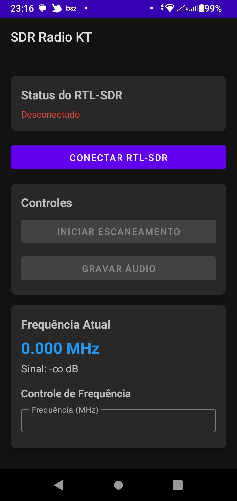

# SDR Radio KT - Android RTL-SDR App

Um aplicativo Android para rádio definido por software (SDR) usando RTL-SDR via USB OTG.

## Funcionalidades

- **Conexão USB OTG**: Conecta automaticamente ao RTL-SDR via USB
- **Escaneamento de Frequências**: Escaneia de 24 MHz a 1766 MHz
- **Gravação de Áudio**: Salva sinais de rádio em arquivos WAV
- **Visualização em Tempo Real**: Gráfico de espectro de frequência
- **Interface Moderna**: Material Design com controles intuitivos

## Requisitos

- Android 5.0+ (API 21+)
- Dispositivo com suporte a USB OTG
- RTL-SDR (RTL2832U)
- Permissões de armazenamento e USB

## Instalação

1. Clone o repositório:

```bash
git clone <repository-url>
cd sdr_radio_kt
```

2. Baixe o RTL-SDR:

```bash
./download_rtlsdr.sh
```

3. Compile o projeto:

```bash
./gradlew assembleDebug
```

4. Instale no dispositivo:

```bash
./gradlew installDebug
```

## Uso

1. **Conectar RTL-SDR**: Conecte o RTL-SDR via USB OTG
2. **Conceder Permissões**: O app solicitará permissões necessárias
3. **Conectar Dispositivo**: Toque em "Conectar RTL-SDR"
4. **Iniciar Escaneamento**: Toque em "Iniciar Escaneamento"
5. **Gravar Áudio**: Toque em "Gravar Áudio" para salvar sinais

## Estrutura do Projeto

```
sdr_radio_kt/
├── app/
│   ├── src/main/
│   │   ├── cpp/           # Código nativo C++
│   │   │   ├── sdr_radio.cpp
│   │   │   ├── sdr_radio.h
│   │   │   └── rtl-sdr/   # Biblioteca RTL-SDR
│   │   ├── java/          # Código Kotlin
│   │   │   └── com/sdrradio/kt/
│   │   │       ├── MainActivity.kt
│   │   │       └── SDRRadio.kt
│   │   └── res/           # Recursos Android
│   └── build.gradle       # Configuração do módulo
├── build.gradle          # Configuração do projeto
├── gradle.properties     # Propriedades Gradle
└── README.md            # Este arquivo
```

## Tecnologias Utilizadas

- **Kotlin**: Linguagem principal
- **C++**: Código nativo para RTL-SDR
- **JNI**: Interface Java-Native
- **CMake**: Build system para código nativo
- **Material Design**: Interface do usuário
- **MPAndroidChart**: Gráficos de espectro
- **Dexter**: Gerenciamento de permissões

## Configuração do RTL-SDR

O app suporta os seguintes dispositivos RTL-SDR:

- RTL2832U (Vendor ID: 0x0bda)
- Produtos IDs: 0x2838, 0x2832, 0x2831, 0x2830, etc.

## Permissões Necessárias

- `USB_PERMISSION`: Acesso ao dispositivo USB
- `WRITE_EXTERNAL_STORAGE`: Salvar gravações
- `READ_EXTERNAL_STORAGE`: Ler gravações
- `RECORD_AUDIO`: Processamento de áudio
- `ACCESS_FINE_LOCATION`: Localização (opcional)

## Gravações

As gravações são salvas em `/sdcard/sdr_recordings/` com o formato:

```
sdr_[timestamp]_[frequency]MHz.wav
```

## Desenvolvimento

Para desenvolvimento:

1. **Configurar Android Studio**
2. **Instalar NDK**: Android Studio > SDK Manager > SDK Tools
3. **Configurar CMake**: Android Studio > SDK Manager > SDK Tools
4. **Sincronizar Gradle**: File > Sync Project with Gradle Files

## Build

```bash
# Debug build
./gradlew assembleDebug

# Release build
./gradlew assembleRelease

# Clean build
./gradlew clean
```

## Troubleshooting

### Screen




### Problemas de Conexão USB

- Verifique se o dispositivo suporta USB OTG
- Teste com outro cabo USB
- Verifique permissões USB no dispositivo

### Problemas de Compilação

- Verifique se o NDK está instalado
- Limpe o projeto: `./gradlew clean`
- Verifique versões do Gradle e Android Gradle Plugin

### Problemas de Permissão

- Conceda todas as permissões solicitadas
- Verifique configurações de armazenamento do dispositivo

## Licença

Este projeto está licenciado sob a licença MIT.

## Contribuição

Contribuições são bem-vindas! Por favor, abra uma issue ou pull request.

## Suporte

Para suporte, abra uma issue no repositório do projeto.
